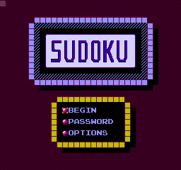
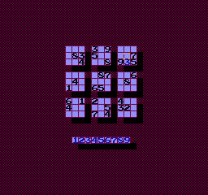

# NES Sudoku

A Sudoku-style puzzle game implemented in 6502 assembly for the Nintendo Entertainment System (NES).

<p align="left">
  
  &nbsp;&nbsp;&nbsp;
  
</p>

## Overview

This project implements a playable Sudoku interface on NES hardware, including board navigation, number placement, and a basic UI system.

The focus of the project is on input handling, grid-based navigation, and rendering a structured puzzle layout within the constraints of the NES.

---

## Gameplay

* Navigate the board using the **D-Pad**
* Press **Select** to cycle the active number (1–9)
* Press **A** to place the selected number
* Press **B** to erase a number

The game loads into a playable Sudoku puzzle via the **Begin** option on the title screen.

---

## Title Screen

The title screen includes:

* **Begin** – Starts the game (implemented)
* **Password** – Placeholder (not implemented)
* **Options** – Placeholder (not implemented)

---

## Features

* 9×9 Sudoku board rendering
* Cursor-based navigation system
* Number selection and placement
* Distinction between pre-filled and user-entered values
* Structured UI layout for puzzle interaction

---

## Limitations

* No solution checking or validation logic
* No puzzle completion detection
* Currently uses a single hardcoded puzzle
* Password and options systems are not implemented

---

## Puzzle Authoring Tool

The `tools/` directory includes **puzzle_maker**, an NES-based utility for creating Sudoku puzzles.

### Usage

* Use the same controls as the main game to navigate and place numbers
* Press **Start** to toggle between:

  * Pre-filled numbers (given clues)
  * Correct solution values

The puzzle data is written to the emulator `.sav` file.

### Importing a Puzzle

* Extract the first **145 bytes** from the `.sav` file
* Include it in the project using `.incbin`
* Place it under `data/puzzles`

This allows custom puzzles to be authored and used by the game.

---

## Technical Notes

* Written in 6502 assembly
* Designed for NES hardware constraints
* Implements:

  * grid-based UI navigation
  * tile-based board rendering
  * input-driven state updates

---

## Project Structure

```text
code/   - Core game logic and rendering
data/   - Puzzle and graphics data
tools/  - Development utilities (e.g., puzzle_maker) and assembler binaries
```

---

## Build

This project uses **WLA-DX v9.3** as the assembler.

### Windows

```bat
build.bat
```

### Notes

* Required assembler binaries are included under `tools/`
* Newer versions of WLA-DX may not be syntax-compatible

---

## Notes

* This project focuses on the interactive and rendering aspects of Sudoku rather than full game logic
* The included puzzle system demonstrates how puzzles can be authored and integrated into the game
* Code structure reflects the original development workflow with minimal refactoring
